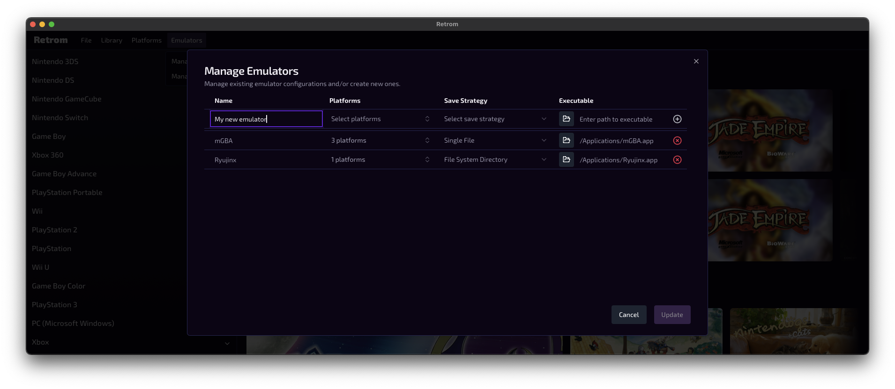
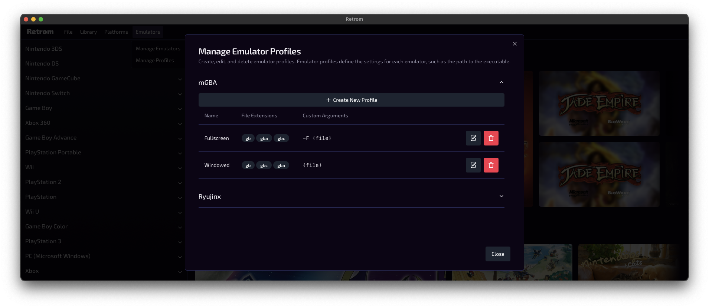

# Retrom Emulator Config

To launch your emulated games on Retrom, you need to configure the emulator(s) that you want to use.
Additionally, for each emulator you will need to configure a launch profile. Launch profiles are used
to specify the command line arguments (if any) that the emulator should use when launching a game.

> [!TIP]
> If you haven't yet setup your library, you may want to check out the [Quick Start Guide](../quick-start/README.md) guide to
> get started then come back here.

<!--toc:start-->

- [Retrom Emulator Config](#retrom-emulator-config)
  - [Adding an Emulator](#adding-an-emulator)
    - [Emulator Fields](#emulator-fields)
  - [Adding an Emulator Profile](#adding-an-emulator-profile)
    - [Profile Fields](#profile-fields)

<!--toc:end-->

## Adding an Emulator

To add an emulator you can click on the `Emulators > Manage Emulators` menu item. You will be presented
with a UI that allows you to add, edit and remove emulators:

### Emulator Fields

- **Name**: The name of the emulator.
- **Platforms**: The platforms that the emulator supports (or you wish to declare support for).
- **Save Strategy**: The strategy that the emulator uses to save games. This can be one of the following, and some emulators
  even support multiple strategies:
  - _Single File_: Save game data is stored in a single file. It is assumed that the save-file has the same name as the ROM file.
  - _File System Directory_: Save game data is stored in a directory. This is also commonly refered to as a NAND directory. Some
    common emulators that follow this strategy are: Dolphin, Yuzu, Ryujinx, etc.
  - _Disk Image_: Save game data is stored in a disk image. This is similar to the _File System Directory_ strategy, but the
    save data is generally not traversable by your file manager. This could represent a memory card, or an internal hard drive.
    Some common emulators that follow this strategy are: PCSX2, Xemu, etc.
- **Executable**: The path to the emulator executable/program on your local system.

## Adding an Emulator Profile

To add an emulator profile you can click on the `Emulators > Manage Profiles` menu item. You will be presented
with a UI that allows you to add, edit and remove emulator profiles:

> [!TIP]
> Sometimes you may want to have more than one profile for a given emulator. For example, you may want to have a profile
> for each platform that the emulator supports. Or, you may want to have a _Fullscreen_ profile and a _Windowed_ profile.

### Profile Fields

- **Name**: The name of the profile.
- **File Extensions**: The file extensions that the profile supports.
  - _*Example*_: `gb, gba, gbc` for an mGBA profiles that will be used for
    Gameboy, Gameboy Advance and Gameboy Color games.
- **Custom Arguments**: Custom command line arguments that the emulator should use when launching a game.
  - When this field is set, you **must** include the `{file}` placeholder. This placeholder will be replaced with the path to the
    ROM file that is being launched.
  - _*Example*_: To launch a Gameboy game with mGBA you could use the following
    custom arguments: `--fullscreen {file}`.
