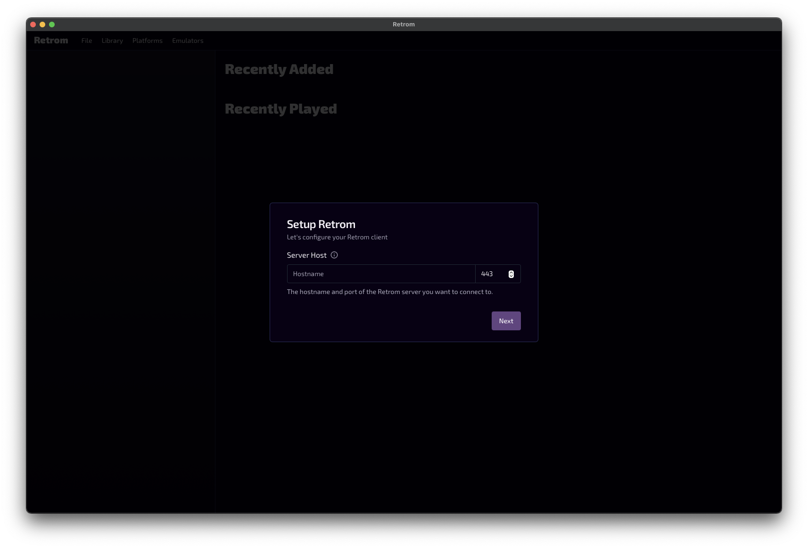
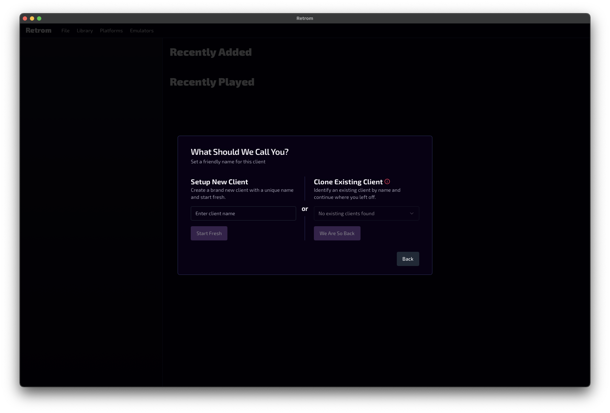
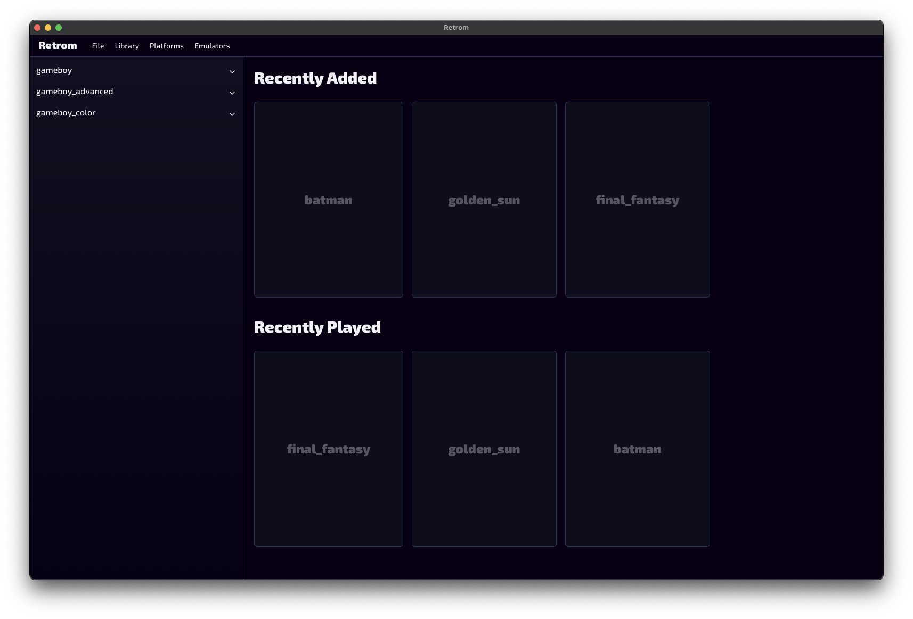
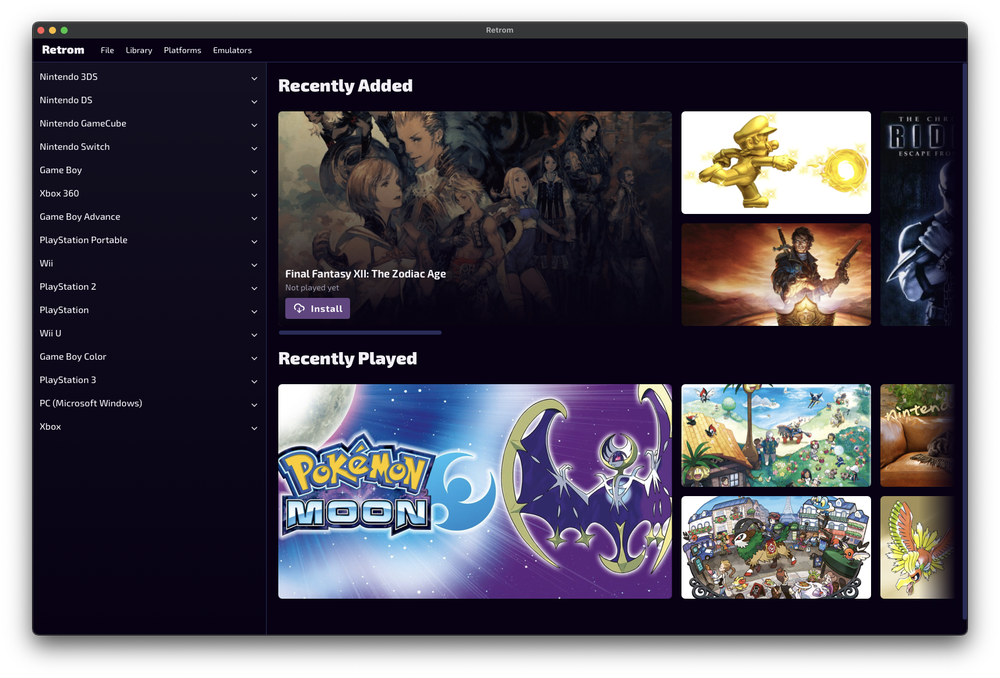

# Retrom Quick Start Guide

> [!TIP]
> After you have completed this guide, you may want to check out the [Emulator Config](../emulator-config/README.md) guide to
> configure your emulators and profiles.

<!--toc:start-->

- [Retrom Quick Start Guide](#retrom-quick-start-guide)
  - [Installation](#installation)
  - [First Time Setup](#first-time-setup)
  - [Initial Library Setup](#initial-library-setup)

<!--toc:end-->

## Installation

Follow the instructions in the [README](../../README.md#installation) to get Retrom up and running.

## First Time Setup

Once you have your retrom server running, and a client installed locally you can begin setting up your library.
The first time you open your client, you should be greeted with a setup wizard:

The hostname should be either the IP address of your Retrom service, or a domain name that points to it.

examples:

- `http://localhost` if you are running it locally, with default values
- `http://retrom.mydomain.com` if you have a domain name pointing to your Retrom service

The port should be the port that your Retrom service is listening on. The default is `5101`.

Following the above two use-cases:

- `5101` if you are running it locally, with default values
- `80` if you have a domain name pointing to your Retrom service with the `http` protocol
  `443` if using the `https` protocol. Or, you can leave it black and it will be inferred from
  the url you provide.

After you have entered the correct values, click `Next` to proceed to the next step.

This is where you will enter a name for this client. This allows the service to keep track of which client is which
when you add configs for local-specific things like emulators paths etc.

As this is the first client you are setting up, you can name it whatever you like. For each new client you set up, you
will need to give it a unique name, or you can alternatively use an existing client name to share the same config, or
restore an installation.

> [!CAUTION]
> If you share configs across clients, they need to have **exactly** the same paths configured for emulators and anything
> else that is client-specific. If you don't, you will run into issues when trying to launch games when one changes and
> the other no longer matches.
>
> If you are unsure, it is **highly recommended** to keep each _actively used_ client distinct.

After you have entered a name, click `Next` to proceed.

If you ever need to reconnect to your server (for example, if you change the server's IP address), you can do so by
accessing the `File > Connect to Server` menu item at any time.

## Initial Library Setup

To initialize your library, you can access the `Library > Update Library` menu item. This will scan the filesystem
that your service is running on and add any games/platforms it finds to your library. Your client will then look something
like this:

Now you can start downloading metadata for your games by accessing the `Library > Download Metadata` menu item. This will
trigger a job in the service to download metadata from supported providers for all games in your library. It will do a best
effort to match the game to the correct metadata based on file structure, but you may need to manually adjust some games
if they are not fully accurate.

> [!TIP]
> This requires the service to have been properly configured to use the metadata providers. If you are unsure, check the
> [service configuration](../../README.md#server) section of the README.

You can also manually map your platforms to the correct metadata by accessing the `Platforms > Match Platforms` menu item.
This will allow you to select the correct platform identifier for each _platform directory_ in your library. This will
make subsequent metadata downloads more accurate.

After the job is complete, your client will look something like this:

> [!NOTE]
> You may need to restart your client to see all the metadata changes reflected.

